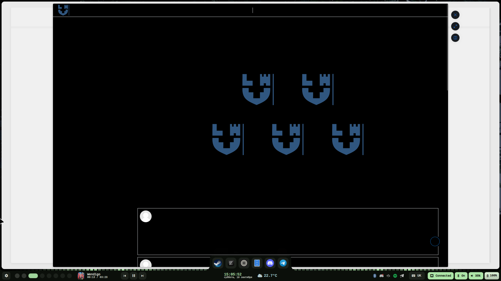
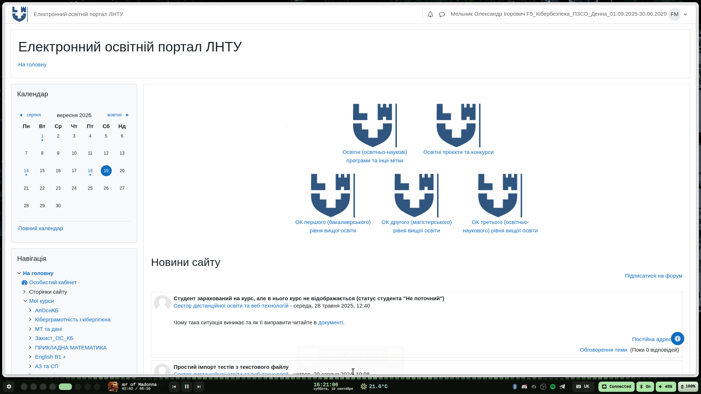

# Moodle-LNTU-Fix

# ПРАЦЮВАТИ ТІЛЬКИ ЧЕРЕЗ ДОКУМЕНТАЦІЮ ПОКРОКОВО!!! 

Встановлюємо у ваш браузер утиліту (Tampermonkey автор Jan Binio)

Встановіть розширення **Tampermonkey** у свій браузер за офіційними посиланнями:
* [Для Google Chrome / Chromium-браузерів](https://chromewebstore.google.com/detail/tampermonkey/dhdgffkkebhmkfjojejmpbldmpobfkfo?hl=uk)
* [Для Mozilla Firefox](https://addons.mozilla.org/uk/firefox/addon/tampermonkey/)
* [Для Opera](https://addons.opera.com/uk/extensions/details/tampermonkey-beta/)

### Крок 2. Створення нового скрипту
1. Натисніть на іконку **Tampermonkey** у правому верхньому кутку вашого браузера.
2. Виберіть пункт **«Створити новий скрипт...»** (*Create a new script...*).
3. Повністю видаліть шаблонний текст, який з'явиться в редакторі, і заміняємо на ось цей.

```javascript
// ==UserScript==
// @name         Moodle LNTU Fixer Simple
// @namespace    http://tampermonkey.net
// @version      2.0
// @description  Простий автоматичний фікс для ЛНТУ
// @author       imtiredwhenitalk
// @match        https://mdl.lntu.edu.ua/*
// @grant        none
// @run-at       document-end
// ==/UserScript==

(function() {
    'use strict';

    function fix() {
        document.documentElement.removeAttribute('class');
        document.body.removeAttribute('class');
        document.documentElement.style = '';
        document.body.style = '';
    }

    fix();

    document.addEventListener('click', function() {
        setTimeout(fix, 100); // Чистить класи через 0.1 сек після кліку
        setTimeout(fix, 500); // Підстраховка через 0.5 сек, якщо сторінка вантажиться довше
    });

    window.addEventListener('popstate', fix);
    window.addEventListener('hashchange', fix);
})();
```
## Мудл до фіксу



## Мудл після фіксу

 |
